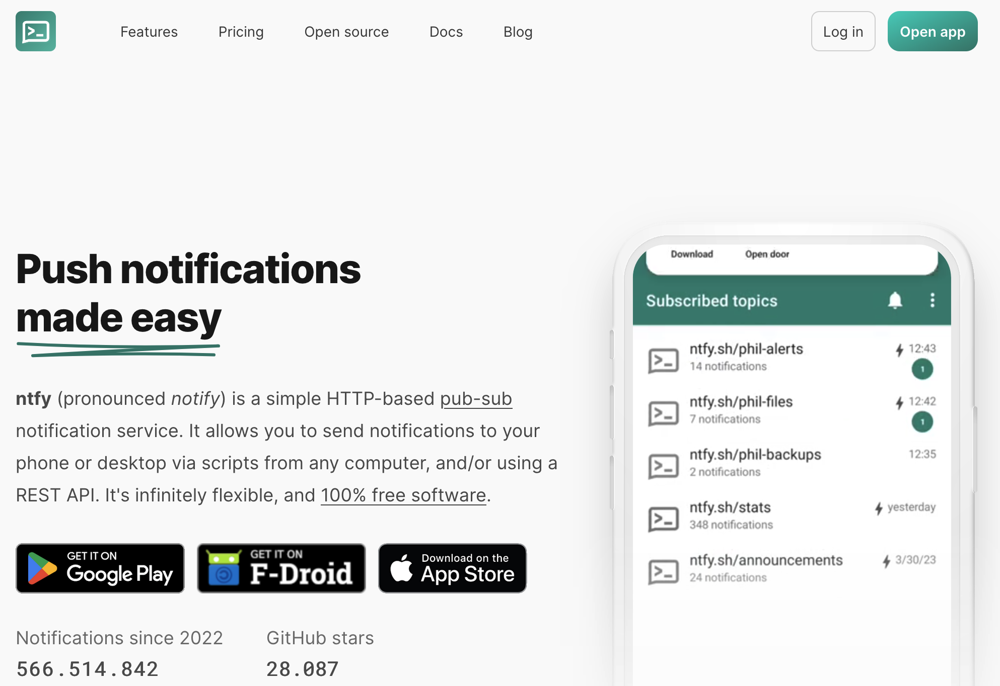

# Begrüßung & Koordination {#intro background-image="img/slide_bg-agenda.png"}

Kurzer Rückblick & Organisatorisches zum Anfang

```{r}
#| label: setup-slide-session
#| echo: false

# Load packages
if (!require("pacman")) install.packages("pacman")
pacman::p_load(
    here, 
    tidyverse,
    gt, gtExtras,
    reticulate,
    countdown
)

# Load schedule
source(here("slides/schedule.R"))
```

```{r}
#| eval: false
#| echo: false

# Run on python setup
reticulate::py_install("requests", pip = TRUE)
```

## Semesterplan

```{r}
#| label: table-schedule-semester
#| echo: false 

schedule %>%
    gt::gt(id = "schedule") %>%
    gt::fmt_markdown(columns = c(Datum, Topic)) %>% 
    gtExtras::gt_theme_538() %>% 
    gt::tab_options(
        table.width = gt::pct(90), 
        table.font.size = "20px"
    ) %>%
    gtExtras::gt_highlight_rows(
        rows = 4,
        fill = "#C50F3C", 
        alpha = 0.2,
        bold_target_only = TRUE,
        target_col = Topic       
    )
```

## Heutige Agenda

#### Überblick über den Ablauf des heutigen Tages

```{r}
#| label: table-schedule-block
#| echo: false

block_schedule_json <- '[
    {
        "Slot": "",
        "Zeit": "09:00 - 09:15",
        "Programmpunkt": "[Begrüßung & Koordination](#intro)"
    },
    {
        "Slot": "",
        "Zeit": "09:15 - 09:30",
        "Programmpunkt": "Kurze Pause"
    },
    {
        "Slot": "1",
        "Zeit": "09:30 - 11:15",
        "Programmpunkt": "[Feldvorbereitung im Fokus](#slot1)"
    },
    {
        "Slot": "",
        "Zeit": "11:15 - 11:30",
        "Programmpunkt": "Kurze Pause"
    },
    {
        "Slot": "2",
        "Zeit": "11:30 - 13:00",
        "Programmpunkt": "[ntfy im Fokus](#slot2)"
    },
    {
        "Slot": "",
        "Zeit": "13:00 - 14:00",
        "Programmpunkt": "Mittagspause"
    },
    {
        "Slot": "3",
        "Zeit": "14:00 - 15:45",
        "Programmpunkt": "[Hands-On: Fragebogentest](#slot3)"
    },
    {
        "Slot": "4",
        "Zeit": "15:45 - 16:00",
        "Programmpunkt": "[Abschluss & Ausblick](#slot4)"
    }
]'

## Load schedule to environment
block_schedule <- fromJSON(block_schedule_json) %>% tibble()
block_schedule %>% 
    gt::gt(id = "block_schedule") %>%
    gt::fmt_markdown(columns = c(Zeit, Programmpunkt)) %>% 
    gtExtras::gt_theme_538() %>% 
    gt::tab_options(
        table.width = gt::pct(90), 
        table.font.size = "20px"
    ) 
    # gtExtras::gt_highlight_rows(
    #     rows = 1,
    #     fill = "#C50F3C", 
    #     alpha = 0.2,
    #     bold_target_only = TRUE,
    #     target_col = Topic       
    # )
```

## Kurze Bestandsaufnahme

#### Arbeitsaufträge zur heutigen Sitzung

-   [ ] **Finalisiert euren Fragebogen** basierend auf dem Feedback
-   [ ] **Finalisiert euer Forschungsdesign** (insb. Schedule für Kurzfragebögen)
-   [ ] **Testet euren Fragebogen**!

##### Gentle Reminder:

-   Wie ist der aktuelle Stand eurer R-Kenntnisse?

-   GitHub Copilot beantragt?

-   Gibt es Analyseverfahren, zu denen Ihr Input benötigt?

## 💬 Let's discuss

#### Organisatorische Hinweise

-   **Handhabung von IDs** (für Teilnehmer:In und Kurzfragebogen):
    -   Manuelle Eingabe der `"Teilnehmer_in ID"`, ID des Kurzfragebogens via Default-Umfrageparameter von SoSci-Survey
-   **Zweiteilung des Befragungszeitraums:**
    -   *Phase 1:* Mo. (26.01) bis Do. (29.01.) &
    -   *Phase 2*: Sa. (31.01) bis Mo. (02.02) / Do. (05.02)
-   **Ablauf der Befraung**:
    -   spätestens Sonntagabend erhaltet Ihr eine Mail mit Link zum Topic, dass Ihr abonnieren müsst & Ausfüllhinweisen

    -   ab Montag startet die Erhebung

    -   bei Problemen: Umgehend Nachricht ins StudOn-Forum

# Short Break {#break1 background-image="img/slide_bg-break_short.png"}

15 Minuten Pause

```{r}
#| label: countdown-break1
#| echo: false

countdown(
    minutes = 15,
    warn_when = 120,
    update_every = 30,
    bottom = 0)
```

# Feldvorbereitung im Fokus {#slot1 background-image="img/slide_bg-section.png"}

Kurze Präsentation des aktuellen Stands der Umfrage, Problemen & Herausforderungen

## 💻 And now … you!

#### Arbeitsauftrag (30 Minuten): Feldvorbereitung

<br>

::: callout-caution
##### Arbeitsauftrag

In euren Gruppen ...

-   erstellt eine **Kurzpräsentation (max. 4 Folien, 5–10 Minuten)**, die auf folgende Punkte eingeht:
    -   Wie sieht euer **aktueller Kurzfragebogen** aus? (1 Folie)
    -   Darstellung des (geplanten) **Schedules für die Umfrage** (1 Folie)
    -   Vorstellung der **Ausfüllhinweise** (1 Folie)
    -   Gibt es Herausforderungen oder Probleme, die Ihr diskutieren möchtet? (1 Folie)
-   Bitte nutzt die **bereitgestellte Folienvorlage (Google Slides)** auf der nächsten Folie
:::

::: callout-note
##### Folienvorlage verwenden

-   Bitte nutzt die **bereitgestellte Folienvorlage (Google Slides)** auf der nächsten Folie
:::

## Get started!

#### Bitte nutzt die jeweilige Folienvorlage für die Dokumentation eurer Ergebnisse

<br>

:::::::::: columns
::: {.column width="20%"}
 [Gruppe A *('Ansprachformen im Alltag')*](https://t1p.de/gukhu)
:::

::: {.column width="5%"}
:::

::: {.column width="20%"}
 [Gruppe B *('Out-of-home recall')*](https://t1p.de/muy33)
:::

::: {.column width="5%"}
:::

::: {.column width="20%"}
 [Gruppe C *("Informelle visuelle Kommunikation")*](https://t1p.de/ayudy)
:::

::: {.column width="5%"}
:::

::: {.column width="20%"}
 [Gruppe D *("Sticky Politics"*)](https://t1p.de/t9pbd)
:::
::::::::::

```{r}
#| label: countdown-pitch
#| echo: false

countdown(
    minutes = 30,
    warn_when = 300,
    update_every = 30,
    bottom = 0)
```

# Short Break {#break2 background-image="img/slide_bg-break_short.png"}

15 Minuten Pause

```{r}
#| label: countdown-break2
#| echo: false

countdown(
    minutes = 15,
    warn_when = 120,
    update_every = 30,
    bottom = 0)
```

#  `ntfy` im Fokus {#slot2 background-image="img/slide_bg-section.png"}

Vorstellung der Tools für die Feldsteuerung: Planung & Durchführung

##  `ntfy` me!

#### ntfy.sh als Tool für die Feldsteuerung

:::::: columns
::: {.column width="45%"}
-   Nutzung von **ntfy.sh** als einfacher Push-Benachrichtigungsdienst zur Übermittlung von Erinnerungen für ESM-Studien
-   Open-Source, einfach zu bedienen und flexibel anpassbar
-   Skriptbasiertes Scheduling (via Server)
:::

::: {.column width="5%"}
:::

::: {.column width="45%"}
{width="400"}
:::
::::::

## Was ist ntfy.sh?

#### Kurze Erklärung der Funktionsweise

-   **Publish/Subscribe-Prinzip**: Clients abonnieren ein `Topic` (bzw. einen Link) und erhalten sofort Updates
-   Nachrichten lassen sich per **HTTP-Request** (z. B. `curl` oder `python`) senden
-   Funktioniert auf Smartphone & Desktop via **Web-App oder native App**
-   **Kostenlos**, aber mit **Einschränkungen**
    -   "Private" Topics nur mit Pro-Account
    -   Workaround mit **hochindividualisierten Themen**
    -   Aber es bleibt ein **"Restrisiko"**

## Topic als Gatekeeper

#### Vorstellung eines typischen Workflows

-   Topic festlegen (z. B. `dbd25-20260123-block2-live-test-in-course`)
-   Teilnehmende **abonnieren** das Topic in der ntfy App
-   *Server sendet automatisierte & randomisierte Reminder (via systemd)*

##### Beispiel: Reminder mit Titel

```{python}
import requests

topic = "dbd25-YIP2tX54JZ-live-test-in-course"
url = f"https://ntfy.sh/{topic}"

r = requests.post(url, data="Zeit für deine ESM-Abfrage ✅".encode("utf-8"))
r.raise_for_status()
print("Message Status:", r.status_code)
```

<!-- ✅ Live-Button (läuft auf GitHub Pages) -->

```{=html}
<!-- <div style="margin-top: 0.8rem;">
  <button id="send-ntfy" style="padding: 0.4rem 0.8rem; font-size: 0.9rem;">
    🔔 Live senden (ntfy)
  </button>
  <span id="ntfy-result" style="margin-left: 0.6rem; font-family: monospace;"></span>
</div>

<script>
document.getElementById("send-ntfy").onclick = async () => {
  const topic = "dbd25-20260123-block2-live-test-in-course";
  const url = `https://ntfy.sh/${topic}`;
  const msg = "Zeit für deine ESM-Abfrage ✅ (von GitHub Pages)";

  const out = document.getElementById("ntfy-result");
  out.textContent = "sending...";

  try {
    const res = await fetch(url, { method: "POST", body: msg });
    out.textContent = `HTTP ${res.status}`;
  } catch (e) {
    out.textContent = `Error`;
  }
};
</script> -->
```

## `nfty_scheduler` als little helper

#### Eigenes [-Projekt](https://github.com/chrdrn/dbd25-nfty_scheduler) zur Steuerung der Fragebögen

-   Python-CLI als leichtes Paket (`run.py` + `ntfy_reminder/`)
-   Helper besteht aus drei Teilen bzw. trennt **Konfiguration, Planung** und **Versand**:
    -   `.env` definiert die globalen Parameter,

    -   `plan` erzeugt `out/schedule.json`,

    -   `send` verschickt

## Was der Helper steuer kann

#### Folgende Argumente werden mit dem Helper abgebildet bzw. können definiert werden

-   Zeitlogik: `--mode interval|windows`, `--start`, `--end`, `--min-gap`

-   Dichte: `--per-day`, `--days`, `--seed` (reproduzierbar)

-   Zielgruppe: `--participant-id` (personalisierte Pläne)

-   Ausgabe: `--dry-run`, `--explain`, `--out`

## Arbeiten im  Google Colab

#### Demo-Notebook aus dem Helper-Repo

:::::: columns
::: {.column width="70%"}
-   Colab ist eine **cloudbasierte Jupyter-Umgebung**, die **direkt im Browser** läuft.
-   Notebooks werden auf Googles Servern ausgeführt und **vereinen Code, Text und Output.**
-   Im Kurs nutzen wir Colab, um die **notwendigen Dateien** (z. B. `.env`, Schedule) aus dem Notebook zu **exportieren**.
:::

::: {.column width="5%"}
:::

::: {.column width="25%"}
\
[Demo-Notebook im Repo](https://colab.research.google.com/github/chrdrn/dbd25-nfty_scheduler/blob/main/demo.ipynb)
:::
::::::

# Lunch Break {background-image="img/slide_bg-break_lunch.png"}

60 Minuten Mittagspause

# Hands-on: Testet euren Fragebogen {#slot3 background-image="img/slide_bg-section.png"}

Nutzung des Google Collabs Notebooks zur Überprüfung

## Download  now!

#### Reminder: Bitte downloaded die App um die Notifications zu testen

<br>

::::::: columns
:::: {.column width="50%" style="text-align: center;"}
::: {style="display: flex; justify-content: center;"}

:::

[ iOS](https://apps.apple.com/us/app/ntfy/id1625396347)
::::

:::: {.column width="50%" style="text-align: center;"}
::: {style="display: flex; justify-content: center;"}

:::

[ Android](https://play.google.com/store/apps/details?id=io.heckel.ntfy)
::::
:::::::

##  `ID` Variable hinzufügen!

#### Reminder: Bitte denkt daran, die Frage nach der Teilnehmer:In ID einzbauen

-   Frage sollte auf der **ersten Seite des Fragebogens** stehen
-   **Template-Frage** ist auf **StudOn** verfügbar
-   Preview:

{fig-align="center" width="500"}

## 💻 Hands-on Zeit!

#### Arbeitsauftrag (90 Minuten): Testet euren Fragebogen

::: callout-caution
##### Arbeitsauftrag

In euren Gruppen ...

-   öffnet das [Google Collab](https://colab.research.google.com/github/chrdrn/dbd25-nfty_scheduler/blob/main/demo.ipynb)
-   geht die **Dry-Runs des Beispiels** durch
-   nehmt die notwendigen Anpassung im Abschnitt **Individualisierung** vor
-   Erstellt die notwendigen Dateien (`schedule.json` & `.env`)
:::

::: callout-note
##### Währenddessen: Feedback & Fragen

-   Sucht das Gespräch zu anderen Gruppen und **gebt euch gegenseitig Hilfe und Feedback**
-   Ich bin während der gesamten Zeit für **Fragen und Unterstützung** verfügbar
-   Ich wandere von Gruppe zu Gruppe, um **Feedback zu geben** und **Fragen zu beantworten**
:::

## Bis zum Ende der Sitzung

#### Checkliste

Bis zum Ende der Sitzung benötige ich von euch ...

-   [ ] den finalen **Fragebogenlink**
-   [ ] den finalen **Schedule** eurer Gruppe (exportiert aus dem Google Colab)
-   [ ] die finale **`.env`-Datei** (exportiert aus dem Google Colab)
-   [ ] die **Ausfüllhinweise** für die Umfrage eurer Gruppe

per Mail an [christoph.adrian\@fau.de](mailto:christoph.adrian@fau.de)

# Time for questions {#slot4 background-image="img/slide_bg-question.png"}

## Until we see each other again

#### Die nächsten Schritte

-   spätestens **Sonntagabend** erhaltet Ihr eine **Mail mit den Link zum Topic,** dass ihr abonnieren müsst
-   ab **Montag** startet die **Erhebung** (vier Tage)
-   schaut in die **Datenvorschau und überlegt, wie ihr die Daten auswerten möchtet**
    -   (mindetens Entwurf für) Auswertungsstrategie zur nächsten Sitzung

# Bis zur nächsten Sitzung! {background-image="img/slide_bg-end_session.png"}
